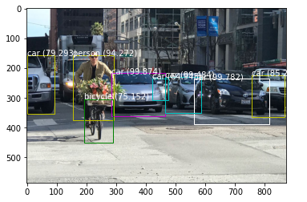

# YOLO-V3
This is an implementation of YOLO V3 using pretrained weights.

Here in this python notebook, a YOLO V3 architecture has been built and instead of finding the optimum weights by training we are writing pretrained weights to the model.

The notebook has the processes in a step by step format and it will be easy for people to follow.

Post processing the output and extracting the bounding box information from the output has been done here.

THe best extracted bounding boxes which are found by the non max suppression(Finds out the best bounding box per object) are plotted on to the image.

find_objects is a single function we can we to do the object detection in an image.

# Sample

input image is 

When using the function 
find_objects(cycle (2).jpeg)

output obtained is

